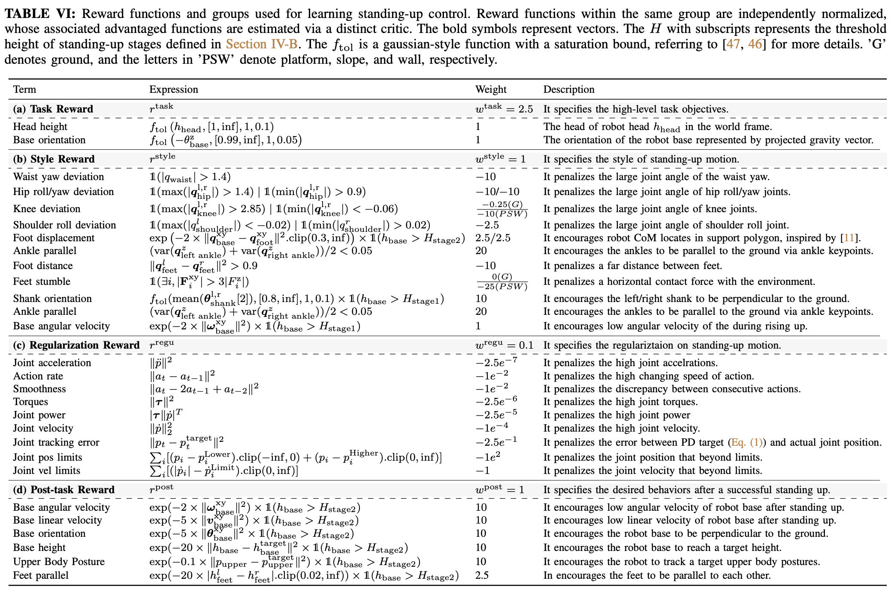

</img>

## HoST - Pytorch (wip)

Implementation of Humanoid Standing Up, from the paper <a href="https://taohuang13.github.io/humanoid-standingup.github.io/">Learning Humanoid Standing-up Control across Diverse Postures</a> out of Shanghai, in Pytorch

Besides for the set of reward functions, the other contribution is validating [an approach using multiple critics](https://openreview.net/forum?id=rJvY_5OzoI) out of Boston University

## Citations

```bibtex
@article{huang2025host,
  title     = {Learning Humanoid Standing-up Control across Diverse Postures},
  author    = {Huang, Tao and Ren, Junli and Wang, Huayi and Wang, Zirui and Ben, Qingwei and Wen, Muning and Chen, Xiao and Li, Jianan and Pang, Jiangmiao},
  journal   = {arXiv preprint arXiv:2502.08378},
  year      = {2025},
}
```
